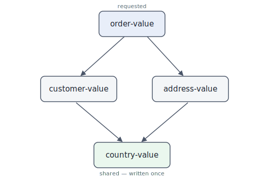

# We let an AI agent finish the sbt plugin we never had time to write

*How spec-driven development turned a one-task Schema Registry downloader into a real plugin — and where the method actually earns its keep.*

---

## Who we are

We're the [**Galaxio**](https://github.com/galax-io) team — engineers who spent years inside various fintech shops and now build the load-testing tooling we always wished we'd had. Plugins, integrations, and practical workflows for Gatling, k6, and the ecosystems around them: a [Kafka plugin](https://github.com/galax-io/gatling-kafka-plugin), [JDBC](https://github.com/galax-io/gatling-jdbc-plugin) and [AMQP](https://github.com/galax-io/gatling-amqp-plugin) plugins, the [Picatinny](https://github.com/galax-io/gatling-picatinny) DSL extensions, and more. The short version: we try to make performance testing less of a setup tax.

This post is about one of the *smaller* tools in that box — and what happened when we finally gave it the attention it never got.

## It started as test infrastructure

Plenty of the systems our users put under load talk over Kafka. And the moment a load test has to produce or consume Kafka messages, you hit the same wall: the payloads are Avro, the schemas live in a Confluent Schema Registry, and your build needs them on disk to generate the classes you serialize against.

There was no sbt plugin that simply pulled those schemas into the build. So we wrote one. It did exactly one thing — given a registry URL, a subject, and a version number, fetch that schema and write it to an `.avsc` file:

```scala
def schemaSubjectToFile(schemaSubject: RegistrySubject): Unit =
  (for {
    _        <- Try(logger.info(s"start downloading schema ${schemaSubject.name} with version ${schemaSubject.version}"))
    schema   <- Try(client.getByVersion(schemaSubject.name, schemaSubject.version, false))
    _        <- createOutputDirIfNeeded
    fileName <- fileNameFromSchema(schema)
    path     <- writeSchemaToFile(schema, fileName)
  } yield path).fold(e => logger.error(e.getMessage), p => logger.info(s"saved schema ${schemaSubject.name} to $p"))
```

That was [version zero](https://github.com/galax-io/sbt-schema-registry-plugin/blob/a090f9b/src/main/scala/org/galaxio/avro/Downloader.scala#L24), in full. A fixed version per subject, fetched with `getByVersion`, the bytes written to disk, any error swallowed into a log line — no typed errors, no `latest` resolution, no schema types beyond Avro, one subject at a time. It unblocked the Gatling work, so we shipped it and moved on.

For contrast, here's [the same method today](https://github.com/galax-io/sbt-schema-registry-plugin/blob/main/src/main/scala/org/galaxio/avro/Downloader.scala#L22) — validate, fetch, write, as a typed `Either` pipeline of small named steps:

```scala
def schemaSubjectToFile(subject: RegistrySubject): Either[DownloadError, Path] =
  for {
    _                  <- validateSubjectName(subject.name)
    resolved           <- fetchSchema(subject)
    (version, body, st) = resolved
    path               <- writeSchema(subject.name, version, body, st)
  } yield path
```

Same job, far less ceremony: no logging woven through the happy path, errors typed instead of swallowed, each step its own named function. But that's getting ahead of the story — for a long while, version zero is exactly where things stayed.

## …and then it sat there

Here's the honest part. The downloader was never the product — it was scaffolding for the thing we actually got paid to build. Side code rarely gets a second pass, and this was side code. So it stayed a stub: one schema type (Avro), one subject at a time, sequential, no way to push schemas *back* to the registry, no compatibility checks, no reference resolution. Everything a real Schema Registry workflow eventually needs, and none of it there.

Not because any of it was hard. Because nobody ever had a free afternoon to write the boring 80%.

## The economics of "the boring 80%" changed

What changed isn't the difficulty of the code. It's the cost of writing it.

A coding agent will produce well-structured, idiomatic Scala faster than you can type the method signatures — *provided* you can tell it precisely what you want. The bottleneck moves off the keyboard and onto the decision: what, exactly, should this thing do, and how should it behave at the edges? That's a far nicer problem to own. So we finally asked the question we'd been deferring: if filling in the missing 80% is suddenly cheap, why not turn the stub into an actual plugin?

## The method: spec first, code second

The approach we used is **spec-driven development**, and concretely the [Spec Kit](https://github.com/github/spec-kit) toolkit (plus a handful of presets and extensions). The loop is simple: you write a specification of what a feature should do, the toolkit helps you turn it into a technical plan, and the plan into a list of discrete tasks. The agent works against *those* — not against a vibe. In practice Spec Kit was a genuinely pleasant way to generate and keep those specs: it scaffolds the spec → plan → tasks structure for you and otherwise stays out of the way.

Why does putting a spec in front of an agent help at all? GitHub's own [writeup on the approach](https://github.blog/ai-and-ml/generative-ai/spec-driven-development-with-ai-get-started-with-a-new-open-source-toolkit/) puts it well: language models are excellent at pattern completion and hopeless at mind-reading. A vague prompt forces the model to guess at thousands of unstated requirements, and it guesses inconsistently. A spec pins down the stable *what*, the plan pins down the flexible *how*, and the tasks cut it into pieces the agent can actually finish — so you're treating it like a literal-minded pair programmer working from a shared source of truth, instead of an oracle.

That same writeup names three situations where the approach pays off — and, a little to our surprise, our work hit all three:

- **Feature work in existing systems** — the big one, and the case the article calls most powerful. A good spec forces clarity on how new behaviour fits the code that's already there, so register, compatibility, parallelism and the rest landed as native parts of the plugin instead of bolted-on extras.
- **Greenfield projects** — every new capability was specced as a self-contained unit, so each one was, in effect, its own tiny greenfield: a clean spec, a clean module, no legacy to fight inside it.
- **Legacy modernization** — the one that surprised us most. The spec became a *license to rewrite*. The raw v0 — a `Unit`-returning method that fetched, wrote, and swallowed errors into a log line — was redesigned into typed `Either` results, sealed ADTs, and small pure functions; the same specs then drove the cross-build to sbt 2.x / Scala 3. We captured the behaviour once and rebuilt it in a cleaner, more functional style, without dragging the old shape forward.

So fitting the method to the work was no stretch — all three boxes were genuinely ticked, which is a big part of why it paid off.

The takeaway is unglamorous and real: with the spec doing the thinking up front, **typing stopped being the constraint**. The features below are the result — most of them written in the kind of afternoon that, a year ago, never came.

---

## What the plugin does now

Quick orientation. The core is still `schemaRegistryDownload`, but it's no longer a dumb loop — it's wildcard-aware, incremental, parallel, and reference-resolving. On top of that there's a push side (register + compatibility), Protobuf and JSON Schema support, a discovery task, and a cross-build so sbt 2.x users get the same plugin. Below, each feature from the user's side — what you set, what you run, what you get. The internals can change; the keys and behaviour are the contract (full source is linked at the end).

You declare what you want; the download task threads the stages together — expand, resolve, prune, fetch:


### Smarter downloads

**Wildcard subjects.** Don't enumerate subjects — match them by regex. Every subject the registry reports that matches is downloaded at its latest version (and de-duped against anything you also named explicitly):

```sbt
.settings(
  /* … */
  schemaRegistrySubjectPatterns := Seq("""order-.*-value""", """.*\.events"""),
)
```

**Incremental downloads — on by default.** A run records the versions it fetched in a manifest; the next run skips any subject already at the current version, so unchanged schemas aren't re-fetched or rewritten. Flip it off to overwrite everything, every time:

```sbt
.settings(
  /* … */
  schemaRegistryIncremental := false, // default: true
)
```

**Parallel fetch, with retries.** Schemas download concurrently over a bounded thread pool, and each fetch is retried with backoff on transient failures. Two knobs:

```sbt
.settings(
  /* … */
  schemaRegistryParallelism := 8, // 1 = sequential, up to 32
  schemaRegistryRetries     := 3, // 0 = no retry
)
```

**Transitive reference resolution — on by default.** Ask for one subject and you get the whole closure it needs to compile: every referenced schema, fetched at the exact pinned version it points to. The walk is cycle-safe and de-duped by subject+version, so you never think about it — you just end up with a complete set of files on disk:

```sbt
.settings(
  /* … */
  schemaRegistrySubjects += RegistrySubject.latest("order-value"),
)
```



You name `order-value`; all four files land together, and the shared `country-value` is written once.

### The push side

**Register schemas.** Point a subject at a local file; `schemaRegistryRegister` reads it, registers it, and reports back the assigned schema ID.

```sbt
.settings(
  /* … */
  schemaRegistryRegistrations := Seq(
    RegistryRegistration("user-value",  baseDirectory.value / "src/main/avro/User.avsc"),
    RegistryRegistration("order-value", baseDirectory.value / "src/main/avro/Order.avsc"),
  ),
)
```

```bash
sbt "Compile / schemaRegistryRegister"
```

**Compatibility checks, before you deploy.** Same registrations, but `schemaRegistryTestCompatibility` only asks the registry *"would this be accepted?"* — and fails the build if any subject is incompatible, surfacing the registry's own verbose reasons. Hang it off `compile` and a breaking change can't reach a deploy:

```sbt
.settings(
  /* … */
  Compile / compile := (Compile / compile)
    .dependsOn(Compile / schemaRegistryTestCompatibility)
    .value,
)
```

### Beyond Avro

**Protobuf and JSON Schema.** Avro is the default; for the other two, name the type (the file extension picks it up too). Same tasks, same keys — only the registration changes:

```sbt
.settings(
  /* … */
  schemaRegistryRegistrations := Seq(
    RegistryRegistration("user-value",  file("src/main/proto/User.proto"), SchemaType.Protobuf),
    RegistryRegistration("event-value", file("src/main/json/Event.json"),  SchemaType.Json),
  ),
)
```

### Discovery

**List subjects.** See what's in a registry without reaching for `curl` or a UI — every subject, sorted, with its version range and compatibility level, optionally narrowed by a case-insensitive substring:

```bash
sbt schemaRegistryListSubjects
# [info] Found 42 subject(s):
# [info]   user-value                                (versions: 1..5, compat: BACKWARD)
# [info]   order-value                               (versions: 1..3, compat: (default))
```

Narrow it: `sbt 'set schemaRegistrySubjectFilter := Some("order")' schemaRegistryListSubjects`.

### One source tree, two sbt lines

**Cross-built for sbt 2.x.** Nothing changes for you across sbt lines — the same `addSbtPlugin`, the same keys, the same behaviour. One release publishes both axes:

- **sbt 1.x** (Scala 2.12) → `sbt-schema-registry-plugin_2.12_1.0`
- **sbt 2.x** (Scala 3) → `sbt-schema-registry-plugin_sbt2_3`

---

## Try it

Add it to your `project/plugins.sbt` (the [Maven Central badge](https://central.sonatype.com/artifact/org.galaxio/sbt-schema-registry-plugin) has the current version):

```sbt
resolvers ++= Seq(
  "Confluent" at "https://packages.confluent.io/maven/",
)

addSbtPlugin("org.galaxio" % "sbt-schema-registry-plugin" % "<plugin-version>")
```

The whole thing — code, tests, and the specs the agent worked from — lives at **[github.com/galax-io/sbt-schema-registry-plugin](https://github.com/galax-io/sbt-schema-registry-plugin)**. If you wrangle Kafka, Avro, and a Schema Registry from sbt, hopefully it saves you the afternoon it kept costing us. Issues and pull requests are welcome — and if it's useful, a star helps other people find it.
